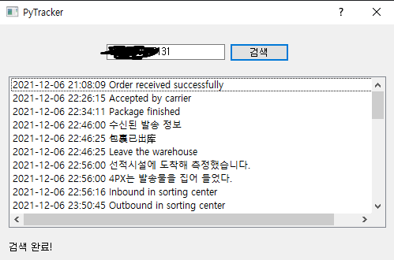

# aliexpress-tracker
파이썬으로 만든 알리익스프레스 통합 배송 추적기입니다. China Post Small Packet, Aliexpress Standard Shipping등의 배송을 지원합니다. 배송 추척이 지원되는 사이트 범위는 [에이씨티앤코아물류](http://www.actcore.kr/), [우체국 택배](https://service.epost.go.kr/iservice/usr/trace/usrtrc001k01.jsp?displayHeader=N%27), [우체국 택배 (EMS)](https://service.epost.go.kr/trace.RetrieveEmsRigiTrace.comm), [4PX](https://www.aftership.com/ko/couriers/4px), [Cainiao](https://global.cainiao.com/)입니다.

## How to use
* [여기](https://github.com/Hydragon516/aliexpress-tracker/releases)에서 최신 파일을 다운받습니다.
* ali-tracker.exe를 실행합니다.
* 본인의 알리익스프레스 추적 번호를 입력하고 검색을 누릅니다.

